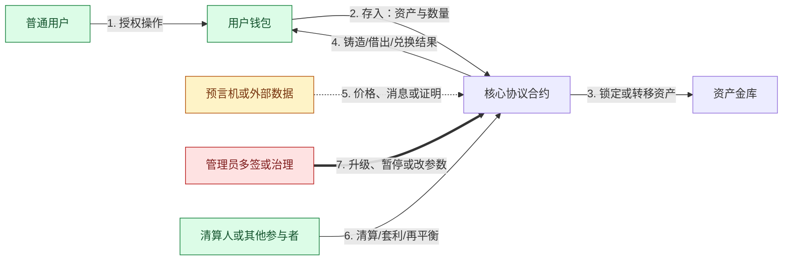
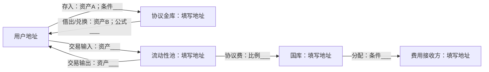
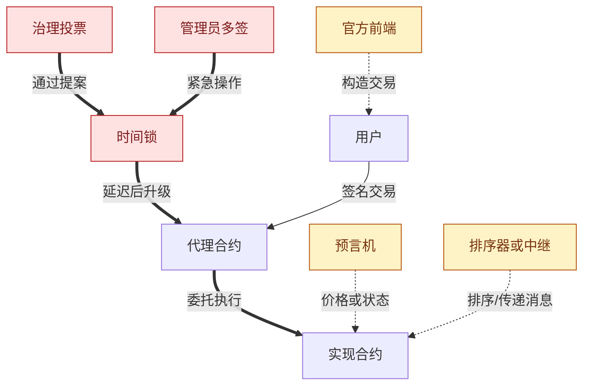

# 信任、资金与控制流绘图模板

> 用途：把“资产在哪里、信息从哪里来、谁能改变规则、失败时谁承担损失”画在同一张图上。图应反映指定网络、合约版本和日期，而不是抽象宣传架构。
>
> 安全提示：图中的地址、角色和权限必须由原始资料或链上状态核验。不要在文件中写入私钥、助记词或 API 密钥。

## 1. 图的研究快照

| 字段 | 填写内容 |
| --- | --- |
| 协议 / 场景 | 【例如：用户用 USDC 抵押借出某稳定币】 |
| 网络 / Chain ID | 【填写】 |
| 合约版本 | 【填写；未知则写未确认】 |
| 关键地址 | 【代理、实现、金库、预言机、桥、多签等】 |
| 快照时间 | 【YYYY-MM-DD HH:mm，时区】 |
| 快照区块 | 【填写】 |
| 绘图者 / 复核者 | 【填写】 |

## 2. 先列清楚图中的对象

### 2.1 参与者与组件

| 编号 | 参与者 / 组件 | 链上 / 链下 | 持有什么 | 能做什么 | 谁控制 | 证据编号 |
| --- | --- | --- | --- | --- | --- | --- |
| N1 | 【用户】 | 【链下+链上账户】 | 【资产/私钥】 | 【存入/提取等】 | 【用户】 | E-___ |
| N2 | 【核心合约】 | 【链上】 | 【状态/资产】 | 【填写】 | 【代码/管理员】 | E-___ |
| N3 | 【预言机】 | 【混合】 | 【价格信息】 | 【更新价格】 | 【填写】 | E-___ |
| N4 | 【管理员多签】 | 【链上账户】 | 【升级权限】 | 【升级/暂停】 | 【签名人】 | E-___ |

### 2.2 资产

| 资产 | 合约地址 | 发行 / 赎回方 | 主要风险 | 证据编号 |
| --- | --- | --- | --- | --- |
| 【资产 A】 | 【地址】 | 【填写】 | 【脱锚/冻结/增发/合约风险等】 | E-___ |
| 【资产 B】 | 【地址】 | 【填写】 | 【填写】 | E-___ |

### 2.3 外部依赖

| 依赖 | 为什么需要 | 停止时会怎样 | 作恶时会怎样 | 是否可替换 | 证据编号 |
| --- | --- | --- | --- | --- | --- |
| 【底层链】 | 【填写】 | 【填写】 | 【填写】 | 【填写】 | E-___ |
| 【前端/RPC】 | 【填写】 | 【填写】 | 【填写】 | 【填写】 | E-___ |
| 【预言机/桥/托管人】 | 【填写】 | 【填写】 | 【填写】 | 【填写】 | E-___ |

## 3. 图例

- 实线箭头 →：资产或链上状态流转
- 虚线箭头 -.->：信息、报价、消息或证明
- 粗线箭头 ==>：升级、暂停、参数修改或资产处置等控制权
- 红色节点：可造成系统级损失的高权限或单点依赖
- 黄色节点：外部依赖或部分可验证的链下系统
- 绿色节点：普通用户或无需特殊权限的参与者

## 4. 正常状态总图

复制下面模板，在节点名称和箭头上写出**具体动作、资产与条件**。箭头按发生顺序编号。

### 正常流程逐步解释

| 步骤 | 触发者 | 输入 | 状态变化 / 输出 | 验证规则 | 失败后果 | 证据编号 |
| --- | --- | --- | --- | --- | --- | --- |
| 1 | 【填写】 | 【填写】 | 【填写】 | 【签名/余额/参数等】 | 【填写】 | E-___ |
| 2 | 【填写】 | 【填写】 | 【填写】 | 【填写】 | 【填写】 | E-___ |
| 3 | 【填写】 | 【填写】 | 【填写】 | 【填写】 | 【填写】 | E-___ |

## 5. 资金流专图

只保留真正持有或转移资产的节点。每条箭头标明：

> 资产名称 + 数量计算方式 + 触发条件 + 最终所有权

### 资金核对表

| 位置 | 地址 | 正常余额含义 | 谁能转出 | 转出条件 | 是否可能冻结 / 损失 | 证据编号 |
| --- | --- | --- | --- | --- | --- | --- |
| 用户钱包 | 【填写】 | 【填写】 | 【私钥持有者】 | 【有效签名】 | 【填写】 | E-___ |
| 合约 / 金库 | 【填写】 | 【填写】 | 【合约规则/管理员】 | 【填写】 | 【填写】 | E-___ |
| 国库 / 费用账户 | 【填写】 | 【填写】 | 【填写】 | 【填写】 | 【填写】 | E-___ |

检查：

- [ ] 存入和取出的资产是否相同；若不同，兑换或赎回承诺来自哪里
- [ ] 资产是直接持有、托管、锁定，还是换成包装或凭证资产
- [ ] 费用、利息、清算罚金和滑点最终由谁获得
- [ ] 资产是否可能被发行方冻结、黑名单或增发
- [ ] TVL 是否把同一资产或衍生凭证重复计算

## 6. 信息与控制流专图

这张图不画普通资金转移，重点回答“谁能改变用户最终得到的结果”。

### 权限核对表

| 权限 | 当前持有者 | 门槛 / 签名数 | 时间锁 | 最大影响 | 用户预警与退出时间 | 证据编号 |
| --- | --- | --- | --- | --- | --- | --- |
| 升级实现 | 【填写】 | 【填写】 | 【填写】 | 【可改变哪些规则】 | 【填写】 | E-___ |
| 暂停 | 【填写】 | 【填写】 | 【填写】 | 【填写】 | 【填写】 | E-___ |
| 修改参数 | 【填写】 | 【填写】 | 【填写】 | 【填写】 | 【填写】 | E-___ |
| 预言机更新 | 【填写】 | 【填写】 | 【填写】 | 【填写】 | 【填写】 | E-___ |
| 跨链消息确认 | 【填写】 | 【填写】 | 【填写】 | 【填写】 | 【填写】 | E-___ |

## 7. 失败与攻击路径图

至少画出一条最可能路径和一条最大损失路径，不要只画正常情况。

| 场景 | 触发条件 | 传播路径 | 谁先受损 | 最大损失 | 能否恢复 | 监控指标 |
| --- | --- | --- | --- | --- | --- | --- |
| 预言机异常 | 【填写】 | 【填写】 | 【填写】 | 【填写】 | 【填写】 | 【填写】 |
| 管理密钥泄露 | 【填写】 | 【填写】 | 【填写】 | 【填写】 | 【填写】 | 【填写】 |
| 流动性枯竭 | 【填写】 | 【填写】 | 【填写】 | 【填写】 | 【填写】 | 【填写】 |
| 跨链 / 排序服务停止 | 【填写】 | 【填写】 | 【填写】 | 【填写】 | 【填写】 | 【填写】 |
| 底层链重组或拥堵 | 【填写】 | 【填写】 | 【填写】 | 【填写】 | 【填写】 | 【填写】 |

## 8. 信任假设清单

把每个假设写成可被证伪的句子。例如：“在用户完成赎回前，至少 2/3 的签名人不会合谋签署恶意升级。”

| 假设编号 | 信任假设 | 被破坏的可观测条件 | 后果 | 缓解措施 | 剩余风险 | 证据编号 |
| --- | --- | --- | --- | --- | --- | --- |
| T-01 | 【填写】 | 【填写】 | 【填写】 | 【填写】 | 【填写】 | E-___ |
| T-02 | 【填写】 | 【填写】 | 【填写】 | 【填写】 | 【填写】 | E-___ |
| T-03 | 【填写】 | 【填写】 | 【填写】 | 【填写】 | 【填写】 | E-___ |

## 9. 图完成后的强制复核

- [ ] 图中每个高权限节点都有具体持有者、门槛和证据
- [ ] 图中每种资产都有地址、发行方和最终所有权说明
- [ ] 已分别标出资金流、信息流和控制流
- [ ] 已标出链上与链下边界
- [ ] 已标出前端、RPC、预言机、排序器、桥和管理员等外部依赖
- [ ] 已画失败路径，而不只是理想流程
- [ ] 已核对代理地址、实现地址与当前版本
- [ ] 图上的状态与快照日期和区块高度一致
- [ ] 已写出用户能否退出、何时无法退出、谁承担最终损失
- [ ] 所有结论均用于技术研究，不被表述为投资建议

> 图只是特定版本和时间点的模型，不代表协议永远按此运行。升级、治理和外部依赖变化后必须重新核验。本材料不构成投资建议。
